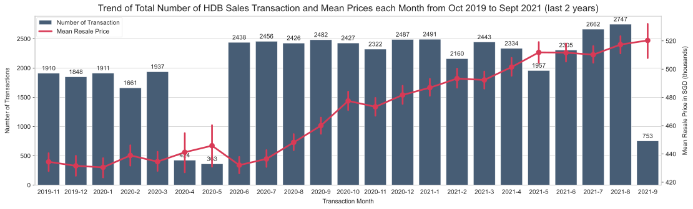
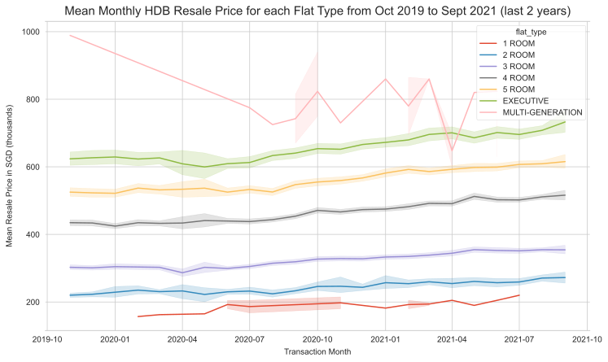
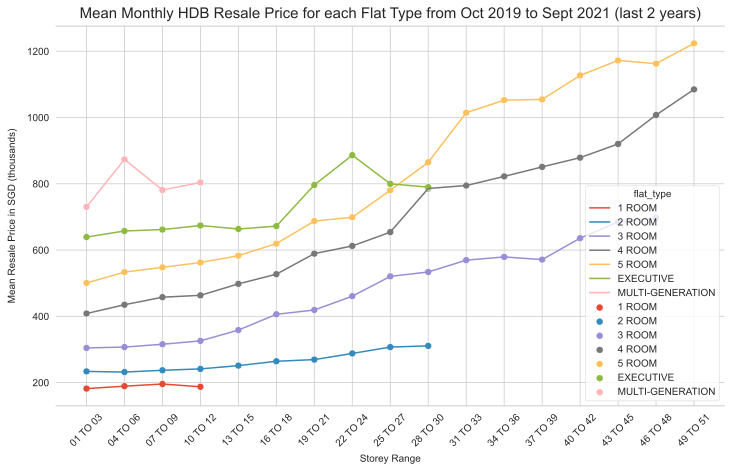
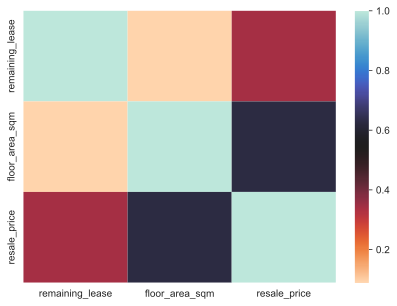
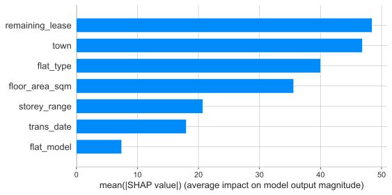
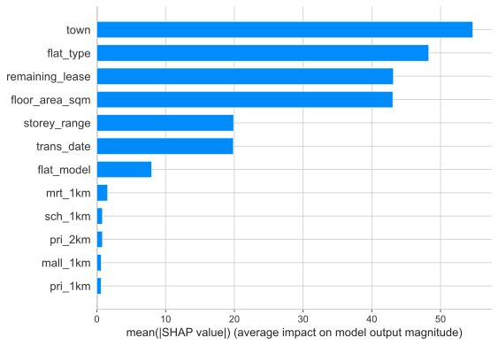

# Visualising and Understanding the factors of HDB resale price trend.
(This analysis was last updated on 04/10/2021.)
***
### Purpose of Exploratory Data Analysis (EDA)
1. Understanding and find out the main factors of prices changes in HDB resale price.
2. Model the price changes into an app for people to use
***
#### All Datasets are sourced and downloaded from data.gov.sg 
1. Resale Flat Prices from 1990s till now (Managed by HDB Singapore) : https://data.gov.sg/dataset/resale-flat-prices

(Only data from the last 2 years will be analysed)
***

```python
# Import libraries
import os
import numpy as np
import pandas as pd
import matplotlib.pyplot as plt
import matplotlib.dates as mdates
import seaborn as sns
plt.style.use('ggplot')
sns.set_style('whitegrid')
%matplotlib inline

from sklearn.preprocessing import StandardScaler, OneHotEncoder, OrdinalEncoder
from sklearn.compose import ColumnTransformer
from sklearn.model_selection import train_test_split
from sklearn.ensemble import RandomForestRegressor
from sklearn.linear_model import Ridge
from sklearn.model_selection import cross_validate
from sklearn.metrics import mean_squared_error
import xgboost as xgb
import shap

from tqdm import tqdm
import time
import requests
from bs4 import BeautifulSoup
from onemapsg import OneMapClient
import creds # import credentials for email and pw later
```

```python
# Complie all resale price data into one dataframe
df = []
folder_path = os.path.join(os.getcwd(),'dataset/resale-flat-prices')
for filename in os.listdir( folder_path ):
    file_path = os.path.join(folder_path, filename)
    if filename.endswith(".csv"): 
        # print(file_path)
        df = df + [pd.read_csv(file_path)]
df = pd.concat(df,axis=0).reset_index(drop=True)

# Filter last 2 years data
df.loc[:,"month"] = pd.to_datetime(df.month)
df = df.rename({"month":"trans_date"},axis=1)
twoyears = pd.Timestamp.today() - pd.Timedelta(days=365*2)
df = df.loc[df.trans_date >= twoyears,:]
df = df.sort_values('trans_date').reset_index(drop=True)
df.head()
```


<div>
<style scoped>
    .dataframe tbody tr th:only-of-type {
        vertical-align: middle;
        font-size:20px;
    }

    .dataframe tbody tr th {
        vertical-align: top;
        font-size:20px;
    }

    .dataframe thead th {
        text-align: right;
        font-size:20px;
    }
</style>
<table border="1" class="dataframe">
  <thead>
    <tr style="text-align: right;" >
      <th></th>
      <th>trans_date</th>
      <th>town</th>
      <th>flat_type</th>
      <th>block</th>
      <th>street_name</th>
      <th>storey_range</th>
      <th>floor_area_sqm</th>
      <th>flat_model</th>
      <th>lease_commence_date</th>
      <th>resale_price</th>
      <th>remaining_lease</th>
    </tr>
  </thead>
  <tbody>
    <tr>
      <th>0</th>
      <td>2019-11-01</td>
      <td>ANG MO KIO</td>
      <td>2 ROOM</td>
      <td>314</td>
      <td>ANG MO KIO AVE 3</td>
      <td>07 TO 09</td>
      <td>44.0</td>
      <td>Improved</td>
      <td>1978</td>
      <td>195000.0</td>
      <td>57 years 02 months</td>
    </tr>
    <tr>
      <th>1</th>
      <td>2019-11-01</td>
      <td>QUEENSTOWN</td>
      <td>3 ROOM</td>
      <td>85</td>
      <td>C'WEALTH CL</td>
      <td>01 TO 03</td>
      <td>58.0</td>
      <td>Standard</td>
      <td>1967</td>
      <td>240000.0</td>
      <td>46 years 02 months</td>
    </tr>
    <tr>
      <th>2</th>
      <td>2019-11-01</td>
      <td>QUEENSTOWN</td>
      <td>3 ROOM</td>
      <td>85</td>
      <td>C'WEALTH CL</td>
      <td>01 TO 03</td>
      <td>58.0</td>
      <td>Standard</td>
      <td>1967</td>
      <td>265000.0</td>
      <td>46 years 02 months</td>
    </tr>
    <tr>
      <th>3</th>
      <td>2019-11-01</td>
      <td>QUEENSTOWN</td>
      <td>3 ROOM</td>
      <td>112</td>
      <td>C'WEALTH CRES</td>
      <td>01 TO 03</td>
      <td>67.0</td>
      <td>Standard</td>
      <td>1969</td>
      <td>250000.0</td>
      <td>48 years 02 months</td>
    </tr>
    <tr>
      <th>4</th>
      <td>2019-11-01</td>
      <td>QUEENSTOWN</td>
      <td>3 ROOM</td>
      <td>50</td>
      <td>C'WEALTH DR</td>
      <td>13 TO 15</td>
      <td>63.0</td>
      <td>Model A</td>
      <td>2015</td>
      <td>540000.0</td>
      <td>94 years 04 months</td>
    </tr>
  </tbody>
</table>
</div>


```python
df.info()
```

    <class 'pandas.core.frame.DataFrame'>
    RangeIndex: 46944 entries, 0 to 46943
    Data columns (total 11 columns):
     #   Column               Non-Null Count  Dtype         
    ---  ------               --------------  -----         
     0   trans_date           46944 non-null  datetime64[ns]
     1   town                 46944 non-null  object        
     2   flat_type            46944 non-null  object        
     3   block                46944 non-null  object        
     4   street_name          46944 non-null  object        
     5   storey_range         46944 non-null  object        
     6   floor_area_sqm       46944 non-null  float64       
     7   flat_model           46944 non-null  object        
     8   lease_commence_date  46944 non-null  int64         
     9   resale_price         46944 non-null  float64       
     10  remaining_lease      46944 non-null  object        
    dtypes: datetime64[ns](1), float64(2), int64(1), object(7)
    memory usage: 3.9+ MB

## Data Clean-up (remaining_lease)
The data format of the "remaining_lease" column is mainly in the "## years ## months" format. This format is non-numerical and will not accurate in providing information in how the remaining lease of the HDB affect it's resale price. Data in this column will be converted into a float value in terms of years.

```python
# Convert remaining_lease to a numerical value
def convert_to_ym(row):
    lease = row["remaining_lease"]
    try:
        if isinstance(lease,str):                              # Format : "## years ## months"
            if len(lease) == 18:
                years = int(lease[0:2])
                months = int(lease[10:12])
                return years + months/12
            elif (len(lease) == 17) & ('months' in lease):     # Format : "## years 0 months"
                return lease[0:2]
            elif (len(lease) == 17):                           # Format : "## years ## month"
                years = int(lease[0:2])
                months = int(lease[10])
                return years + months/12
            elif len(lease) == 8:                              # Format : "## years"
                return lease[0:2]
        elif isinstance(lease, int):                          # Format : "##"
            return lease
    except:
        print("Error")
        print(lease)
        print(type(lease))

df.lease_commence_date = pd.to_datetime(df.lease_commence_date,
                                                format='%Y')
df.loc[:,"lease_commence_year"] =  df.lease_commence_date.dt.year
df.loc[:, "remaining_lease"] = df.apply(convert_to_ym,axis=1)
df.head()
```


<div>
<style scoped>
    .dataframe tbody tr th:only-of-type {
        vertical-align: middle;
        font-size:20px;
    }

    .dataframe tbody tr th {
        vertical-align: top;
        font-size:20px;
    }

    .dataframe thead th {
        text-align: right;
        font-size:20px;
    }
</style>
<table border="1" class="dataframe">
  <thead>
    <tr style="text-align: right;">
      <th></th>
      <th>trans_date</th>
      <th>town</th>
      <th>flat_type</th>
      <th>block</th>
      <th>street_name</th>
      <th>storey_range</th>
      <th>floor_area_sqm</th>
      <th>flat_model</th>
      <th>lease_commence_date</th>
      <th>resale_price</th>
      <th>remaining_lease</th>
      <th>lease_commence_year</th>
    </tr>
  </thead>
  <tbody>
    <tr>
      <th>0</th>
      <td>2019-11-01</td>
      <td>ANG MO KIO</td>
      <td>2 ROOM</td>
      <td>314</td>
      <td>ANG MO KIO AVE 3</td>
      <td>07 TO 09</td>
      <td>44.0</td>
      <td>Improved</td>
      <td>1978-01-01</td>
      <td>195000.0</td>
      <td>57.166667</td>
      <td>1978</td>
    </tr>
    <tr>
      <th>1</th>
      <td>2019-11-01</td>
      <td>QUEENSTOWN</td>
      <td>3 ROOM</td>
      <td>85</td>
      <td>C'WEALTH CL</td>
      <td>01 TO 03</td>
      <td>58.0</td>
      <td>Standard</td>
      <td>1967-01-01</td>
      <td>240000.0</td>
      <td>46.166667</td>
      <td>1967</td>
    </tr>
    <tr>
      <th>2</th>
      <td>2019-11-01</td>
      <td>QUEENSTOWN</td>
      <td>3 ROOM</td>
      <td>85</td>
      <td>C'WEALTH CL</td>
      <td>01 TO 03</td>
      <td>58.0</td>
      <td>Standard</td>
      <td>1967-01-01</td>
      <td>265000.0</td>
      <td>46.166667</td>
      <td>1967</td>
    </tr>
    <tr>
      <th>3</th>
      <td>2019-11-01</td>
      <td>QUEENSTOWN</td>
      <td>3 ROOM</td>
      <td>112</td>
      <td>C'WEALTH CRES</td>
      <td>01 TO 03</td>
      <td>67.0</td>
      <td>Standard</td>
      <td>1969-01-01</td>
      <td>250000.0</td>
      <td>48.166667</td>
      <td>1969</td>
    </tr>
    <tr>
      <th>4</th>
      <td>2019-11-01</td>
      <td>QUEENSTOWN</td>
      <td>3 ROOM</td>
      <td>50</td>
      <td>C'WEALTH DR</td>
      <td>13 TO 15</td>
      <td>63.0</td>
      <td>Model A</td>
      <td>2015-01-01</td>
      <td>540000.0</td>
      <td>94.333333</td>
      <td>2015</td>
    </tr>
  </tbody>
</table>
</div>


## Dtype Conversion and Prelimary Data Cleaning
Analyse unique entries in each individual columns and convert to categorical data if <= 100 categories.
- Inconsistent labels such as "MULTI-GENERATION" and "MULTI GENERATION" will be standardized.
- Resale price will be converted into in terms of thousands for easier vizualisation and understanding.

```python
df.dtypes
```


    trans_date             datetime64[ns]
    town                           object
    flat_type                      object
    block                          object
    street_name                    object
    storey_range                   object
    floor_area_sqm                float64
    flat_model                     object
    lease_commence_date    datetime64[ns]
    resale_price                  float64
    remaining_lease                object
    lease_commence_year             int64
    dtype: object


```python
df.nunique()
```


    trans_date               23
    town                     26
    flat_type                 7
    block                  2526
    street_name             551
    storey_range             17
    floor_area_sqm          156
    flat_model               20
    lease_commence_date      54
    resale_price           2082
    remaining_lease         585
    lease_commence_year      54
    dtype: int64


```python
# Convert columns to categories dtypes
df.trans_date = df.trans_date.dt.date
df.town = df.town.astype('category')  
df.block = df.block.astype('category')
df.street_name = df.street_name.str.lower().astype('category')
df.storey_range = df.storey_range.astype('category')  
df.flat_model = df.flat_model.str.lower().astype('category')
df.remaining_lease = df.remaining_lease.astype('float')

# Convert flat_type to Category
print(df.flat_type.value_counts())
df.loc[df.flat_type=="MULTI GENERATION","flat_type"] = "MULTI-GENERATION"
df.flat_type = df.flat_type.astype('category')

# Convert Resale Price to in terms of 'thousands'
df.resale_price = df.resale_price / 1000
```

    4 ROOM              19675
    5 ROOM              12238
    3 ROOM              10538
    EXECUTIVE            3698
    2 ROOM                756
    MULTI-GENERATION       20
    1 ROOM                 19
    Name: flat_type, dtype: int64

```python
# Rearrange columns
df = df.loc[:, [ 'trans_date','lease_commence_date', 'remaining_lease',
                'town', 'street_name', 'block', 'storey_range',
                'flat_model', 'flat_type', 'floor_area_sqm', 'resale_price' ] ]
df.head()
```


<div>
<style scoped>
    .dataframe tbody tr th:only-of-type {
        vertical-align: middle;
        font-size:20px;
    }

    .dataframe tbody tr th {
        vertical-align: top;
        font-size:20px;
    }

    .dataframe thead th {
        text-align: right;
        font-size:20px;
    }
</style>
<table border="1" class="dataframe">
  <thead>
    <tr style="text-align: right;">
      <th></th>
      <th>trans_date</th>
      <th>lease_commence_date</th>
      <th>remaining_lease</th>
      <th>town</th>
      <th>street_name</th>
      <th>block</th>
      <th>storey_range</th>
      <th>flat_model</th>
      <th>flat_type</th>
      <th>floor_area_sqm</th>
      <th>resale_price</th>
    </tr>
  </thead>
  <tbody>
    <tr>
      <th>0</th>
      <td>2019-11-01</td>
      <td>1978-01-01</td>
      <td>57.166667</td>
      <td>ANG MO KIO</td>
      <td>ang mo kio ave 3</td>
      <td>314</td>
      <td>07 TO 09</td>
      <td>improved</td>
      <td>2 ROOM</td>
      <td>44.0</td>
      <td>195.0</td>
    </tr>
    <tr>
      <th>1</th>
      <td>2019-11-01</td>
      <td>1967-01-01</td>
      <td>46.166667</td>
      <td>QUEENSTOWN</td>
      <td>c'wealth cl</td>
      <td>85</td>
      <td>01 TO 03</td>
      <td>standard</td>
      <td>3 ROOM</td>
      <td>58.0</td>
      <td>240.0</td>
    </tr>
    <tr>
      <th>2</th>
      <td>2019-11-01</td>
      <td>1967-01-01</td>
      <td>46.166667</td>
      <td>QUEENSTOWN</td>
      <td>c'wealth cl</td>
      <td>85</td>
      <td>01 TO 03</td>
      <td>standard</td>
      <td>3 ROOM</td>
      <td>58.0</td>
      <td>265.0</td>
    </tr>
    <tr>
      <th>3</th>
      <td>2019-11-01</td>
      <td>1969-01-01</td>
      <td>48.166667</td>
      <td>QUEENSTOWN</td>
      <td>c'wealth cres</td>
      <td>112</td>
      <td>01 TO 03</td>
      <td>standard</td>
      <td>3 ROOM</td>
      <td>67.0</td>
      <td>250.0</td>
    </tr>
    <tr>
      <th>4</th>
      <td>2019-11-01</td>
      <td>2015-01-01</td>
      <td>94.333333</td>
      <td>QUEENSTOWN</td>
      <td>c'wealth dr</td>
      <td>50</td>
      <td>13 TO 15</td>
      <td>model a</td>
      <td>3 ROOM</td>
      <td>63.0</td>
      <td>540.0</td>
    </tr>
  </tbody>
</table>
</div>


# Trend visualization

### Part 1: Overall Trend Analysis (Price vs Transaction Date)
Since time-series analysis is not going to be the main focus of the this analysis, we need to ensure that the HDB resale prices do not major fluctuations (Seasonality). Otherwise, there may be a need to account for them.

```python
fig, ax = plt.subplots(figsize=(18,5))

sns.countplot(x="trans_date",data=df,
              ax=ax, color='#3F5D7D')
ax2 = ax.twinx()
sns.pointplot(x="trans_date", y="resale_price",
              data=df,
              ax=ax2, color="#D83A56")

fig.patch.set_facecolor('xkcd:white')
ax.spines[["top","right"]].set_visible(False)  
ax2.grid(False)
              
ax.set_title("Trend of Total Number of HDB Sales Transaction and Mean Prices each Month from Oct 2019 to Sept 2021 (last 2 years)",
            fontsize=15, fontweight=10,
            pad=8)
ax.set_xlabel("Transaction Month",
            fontsize=10, fontweight=15,
            labelpad=6)
ax.set_ylabel("Number of Transactions",
            fontsize=10, fontweight=15,
            labelpad=10)
ax2.set_ylabel("Mean Resale Price in SGD (thousands)",
            fontsize=10, fontweight=15,
            labelpad=10)
fig.legend(labels=['Number of Transaction','Mean Resale Price'],
            loc="center", bbox_to_anchor=(0.18, 0.83))
ax.axes.set_xticklabels([ f"{date.year}-{date.month}" for date in df.trans_date.unique()])

# Label Countplots (top of bar)
for p in ax.patches:
    height = p.get_height()
    ax.text(x = p.get_x()+(p.get_width()/2),
            y = height+50,
            s = "{:.0f}".format(height),
            ha = "center")
plt.xticks(rotation=10)
fig.show()
```


    

    


### Some observations for the figure above:
- Overall increasing trend for the last 2 years, but not linearly.
- No obvious seasonality 
- Resale prices does not seem to be affected by the number of transaction (Demand and Supply). 
    - However, this is only a guage as these dataset only shows the transactions and not the number of interested buyers or unsuccessful sellers.
    - Low number of transaction in April and May 2020 is due to circuit breaker in Singapore, where there were minimum interactions.

## Part 2: Trend of HDB Resale Flat Prices with respect to Time of Transaction for each Flat Type. 
### (Price vs Transaction Date, by Flat Type)
Flat type(i.e Number of Rooms,etc) is an important factor in every home buyer's choice. A further exploration into individual mean HDB resale prices for each flat types in Singapore provides a deeper understanding to how the choice of flat types may affect the resales prices.

```python
fig, ax = plt.subplots(figsize=(12,7))

sns.lineplot(x="trans_date", y="resale_price",
             data=df, hue="flat_type", ax=ax)

ax.spines[["left","right"]].set_visible(False)  
fig.patch.set_facecolor('xkcd:white')

ax.set_title("Mean Monthly HDB Resale Price for each Flat Type from Oct 2019 to Sept 2021 (last 2 years)",
            fontsize=15, fontweight=30,
            pad=8)
ax.set_xlabel("Transaction Month",
            fontsize=10, fontweight=15,
            labelpad=6)
ax.set_ylabel("Mean Resale Price in SGD (thousands)",
            fontsize=10, fontweight=15,
            labelpad=10)

fig.show()
```


    

    


### Some observations for the figure above:
- A linear trend can be see most all flat types except the "Multi-Generation".
    - This attributes to the overall linear increase in resale prices.
- Non-linearity in the "Multi-Generation" flat types can be see as the main cause of fluctuation in overall trend in resale prices.

Hence, with the exception of the "Multi-Generation" flat type, both time of transaction(trans_date) and flat type will be useful in predicting the prices of the flat type.

## Part 3: HDB Resale Flat Prices vs Flat Size
Similarly, choice of floor area is an important factor for a home buyer.

```python
fig, ax = plt.subplots(figsize=(12,7))

sns.scatterplot(x="floor_area_sqm", y="resale_price", hue="flat_type",
                data=df, ax=ax)
sns.regplot(x="floor_area_sqm", y="resale_price", color='black',
                data=df, ax=ax, scatter=False)

fig.patch.set_facecolor('xkcd:white')
ax.spines[["left","right"]].set_visible(False)

ax.set_title("HDB Resale Price vs Floor Area from Oct 2019 to Sept 2021 (last 2 years)",
            fontsize=15, fontweight=30,
            pad=8)
ax.set_xlabel("Floor Area (metre square)",
            fontsize=10, fontweight=15,
            labelpad=6)
ax.set_ylabel("Mean Resale Price in SGD (thousands)",
            fontsize=10, fontweight=15,
            labelpad=10)

fig.show()
```


    

    


### Some observations for the figure above:
- Floor area increases with increasing room size, with Executive being the biggest.
- Resale price tends to increase with floor area.
- However, floor size is may not be an major factor due to the large range of possible resale prices(vertical range) it can lie after 50m^2.

## Part 4: HDB Resale Flat Prices vs Storey Range
Choice of which floor to live in may play a part in resale price of the flat. Usually, resale prices will be higher on the higher floors due to a better view and less noise pollution from the surrounding ground floor.

```python
fig, ax = plt.subplots(figsize=(12,7))
fig.patch.set_facecolor('xkcd:white')
data = df.groupby(["flat_type","storey_range"]).mean().reset_index()

sns.scatterplot(x="storey_range", y="resale_price", marker='o', s=50,
             data=data,hue="flat_type", ax=ax)
sns.lineplot(x="storey_range", y="resale_price",
             data=data,hue="flat_type", ax=ax)

ax.spines[["left","right"]].set_visible(False)  
ax.set_title("Mean Monthly HDB Resale Price for each Flat Type from Oct 2019 to Sept 2021 (last 2 years)",
            fontsize=15, fontweight=30,
            pad=8)
ax.set_xlabel("Storey Range",
            fontsize=10, fontweight=15,
            labelpad=6)
ax.set_ylabel("Mean Resale Price in SGD (thousands)",
            fontsize=10, fontweight=15,
            labelpad=10)
plt.xticks(rotation=45)
fig.show()
```


    

    


### Observations:
- An overall linear trend can be seen in each flat type, except 1 room flats.
- A flatter trend can seen in 1 and 2 room flats due to the government's effort to keep prices low for seniors and low-income families.

(https://www.straitstimes.com/singapore/housing/prime-areas-to-be-kept-diverse-and-inclusive-with-range-of-hdb-flat-types-for)

# Machine Learning Part 1
In this section, we will creating machine learning models. We will not be using "block" and "street_name" columns of our dataset because prediction using possibly new values that are not in the current dataset will cause errors and inaccuracies in the future. (i.e New blocks in new locations will be built.)

```python
plt.figure(figsize=(7,5))
sns.heatmap(df.corr(),cmap='icefire_r')
plt.show()
```


    

    


```python
# Basic Testing Pipeline
def ML_pipeline(data,model,num_vars,cat_vars,model_type=""):
    data_pipeline = ColumnTransformer([
                    ('numerical', StandardScaler(), num_vars),
                    ('categorical', OrdinalEncoder(), cat_vars)
                    ])
    X_processed = data_pipeline.fit_transform(data)
    y = data.loc[:,'resale_price']

    X_train, X_test, y_train, y_test = train_test_split(X_processed, y,
                                                        test_size=.2,random_state=123)
    
    # Cross Validation Results
    scores = cross_validate(model, X_train, y_train,
                            scoring=["r2","neg_root_mean_squared_error"],
                            cv=5, n_jobs=-1)
    print("5CV R2 Score: {}".format( np.mean(scores['test_r2'])) )
    print("5CV RSME Score: {}".format(-1*
            np.mean(scores['test_neg_root_mean_squared_error'])) )

    # Test Results
    model.fit(X_train,y_train)
    print("Test R2 Score: {}".format(model.score(X_test,y_test)))
    print("Test RMSE Score: {}\n".format( 
         mean_squared_error(y_test,model.predict(X_test),squared=False)))

    if model_type != "":
        print("Preparing SHAP analysis.")
        if model_type == "tree":
            explainer = shap.TreeExplainer(model)
        elif model_type == "linear":
            explainer = shap.LinearExplainer(model)
    
        shap_values = explainer.shap_values(X_test[:100])
        Xcolumns = num_vars + cat_vars
        shap.summary_plot(shap_values, X_test[:100],
                            Xcolumns, plot_type="bar")
        if (model_type!= "tree") & (model_type!= "linear"):
            print("Failed. No SHAP analysis. Only for Tree or Linear models.")

    return model
```

```python
# Choice of Features
num_vars = ['floor_area_sqm','remaining_lease']
cat_vars = ['trans_date','town', 'storey_range',
            'flat_model', 'flat_type']
```

```python
print("Testing w/ RF Regressor Model")
ML_pipeline(df, RandomForestRegressor(random_state=123),
            num_vars,cat_vars,"")
```

    Testing w/ RF Regressor Model
    5CV R2 Score: 0.932898890273037
    5CV RSME Score: 41.20869905253422
    Test R2 Score: 0.9396568879159997
    Test RMSE Score: 39.94166579456954


    RandomForestRegressor(random_state=123)


```python
print("Testing w/ Linear Regression Model")
ML_pipeline(df, Ridge(random_state=123),
            num_vars,cat_vars,"")
```

    Testing w/ Linear Regression Model
    5CV R2 Score: 0.6142070753421051
    5CV RSME Score: 98.81486326663783
    Test R2 Score: 0.628436030923156
    Test RMSE Score: 99.11265681311731


    Ridge(random_state=123)


```python
print("Testing w/ XGBR Regressor Model")
ML_pipeline(df, xgb.XGBRegressor(),
            num_vars,cat_vars,"tree")
```

    Testing w/ XGBR Regressor Model
    5CV R2 Score: 0.9440822345223804
    5CV RSME Score: 37.616035846215155
    Test R2 Score: 0.9503124626248961
    Test RMSE Score: 36.243994650021854
    
    Preparing SHAP analysis.


    

    


    XGBRegressor(base_score=0.5, booster='gbtree', colsample_bylevel=1,
                 colsample_bynode=1, colsample_bytree=1, gamma=0, gpu_id=-1,
                 importance_type='gain', interaction_constraints='',
                 learning_rate=0.300000012, max_delta_step=0, max_depth=6,
                 min_child_weight=1, missing=nan, monotone_constraints='()',
                 n_estimators=100, n_jobs=12, num_parallel_tree=1, random_state=0,
                 reg_alpha=0, reg_lambda=1, scale_pos_weight=1, subsample=1,
                 tree_method='exact', validate_parameters=1, verbosity=None)


## Observation:
- The XGboost model provides the best results among 3 models in terms of highest R^2 value and lowest RSME for both cross validation and test set result.
- According to SHAP, Remaining_lease, town and flat type are the most important factors in determining resale price.
- Flat_model is the least important factor as it is a subset of the flat types.

# Feature Engineering
After browsing articles, property market sites and social media, 3 additional features are found to be potential features to improve our model.

    1. Nearby MRTs (within 1km radius)
    2. Nearby Schools (within 1km radius)
    3. Nearby Primary Schools (within 1km and 2km radius)
        - Within 1km and 2km radius gives higher priority during balloting
        ( https://www.moe.gov.sg/primary/p1-registration/distance/ )
    4. Nearby Malls (within 1km radius)

Assuming a straight line walking route, it takes about 12mins to walk 1km according to the calculation below. In order to determine the actual land distance, we can use geocoordinates from Singapore's onemap API to determine lat and long distance and convert it using a multiplier with respect to Singapore location. 

```python
# Start onemap client
Client = OneMapClient(creds.email,creds.password)

def countdown(count,start):
    # Sleep counter abides onemap's rules (max 250 query/s)
    count += 1
    if count >= 250:
        end = time.time()
        time.sleep(end-start)
        start = time.time()
        count = 0
    return count,start

# Distance Multiplier Calculation
latlong_dist = np.sqrt(0.1**2 + 0.1**2) # 0.1 lat and 0.1 long difference
actual_dist_m = 15.723 * 1000 # According to https://latlongdata.com/distance-calculator/
latlong_multiplier = actual_dist_m/latlong_dist

# Assuming average walking speed as 1.4m/s 
# (according to https://www.healthline.com/health/exercise-fitness/average-walking-speed#average-speed-by-age)
kmpermin = (1.4/1000) * 60
print(f"Expected time for 1km walking distance: {1/kmpermin}")
```

    Expected time for 1km walking distance: 11.904761904761903

```python

```

## Preparing MRT dataset
Dataset can be downloaded directly from the Singapore data gov website at https://data.gov.sg/dataset/train-station-chinese-names or it can be accessed via API below.

```python
# Import Dataset via API
url = 'https://data.gov.sg/api/action/datastore_search?resource_id=65c1093b-0c34-41cf-8f0e-f11318766298&limit=1000'
response = requests.get(url)
print(f"Response Code : {response.status_code}")
mrt_df = pd.json_normalize(response.json()['result']['records'])
mrt_df = mrt_df.loc[:,["mrt_station_english","mrt_line_english"]]
mrt_df.columns = ["station","line"]
mrt_df = mrt_df.loc[mrt_df.line.str.contains("Line"),:] # remove LRTs
mrt_df.head()
```

    Response Code : 200


<div>
<style scoped>
    .dataframe tbody tr th:only-of-type {
        vertical-align: middle;
        font-size:20px;
    }

    .dataframe tbody tr th {
        vertical-align: top;
        font-size:20px;
    }

    .dataframe thead th {
        text-align: right;
        font-size:20px;
    }
</style>
<table border="1" class="dataframe">
  <thead>
    <tr style="text-align: right;">
      <th></th>
      <th>station</th>
      <th>line</th>
    </tr>
  </thead>
  <tbody>
    <tr>
      <th>0</th>
      <td>Jurong East</td>
      <td>North South Line</td>
    </tr>
    <tr>
      <th>1</th>
      <td>Bukit Batok</td>
      <td>North South Line</td>
    </tr>
    <tr>
      <th>2</th>
      <td>Bukit Gombak</td>
      <td>North South Line</td>
    </tr>
    <tr>
      <th>3</th>
      <td>Choa Chu Kang</td>
      <td>North South Line</td>
    </tr>
    <tr>
      <th>4</th>
      <td>Yew Tee</td>
      <td>North South Line</td>
    </tr>
  </tbody>
</table>
</div>


```python
# Adding Longitude and Lattitude Data
mrt_df.loc[:,"lat"] = ""
mrt_df.loc[:,"long"] = ""
start = time.time()
count = 0
for i,row in tqdm(mrt_df.iterrows(), total=mrt_df.shape[0]):
    station_name = row["station"] + " MRT"
    try:
        search = Client.search(station_name,page_num=1)["results"][0]
        mrt_df.loc[i,"lat"] = search["LATITUDE"]
        mrt_df.loc[i,"long"] = search["LONGITUDE"]
        count,start = countdown(count,start)
    except:
        continue
mrt_df.loc[mrt_df.lat.isna(),:] # Checking for any entries with no geo location
```

    100%|██████████| 141/141 [00:35<00:00,  3.99it/s]


<div>
<style scoped>
    .dataframe tbody tr th:only-of-type {
        vertical-align: middle;
        font-size:20px;
    }

    .dataframe tbody tr th {
        vertical-align: top;
        font-size:20px;
    }

    .dataframe thead th {
        text-align: right;
        font-size:20px;
    }
</style>
<table border="1" class="dataframe">
  <thead>
    <tr style="text-align: right;">
      <th></th>
      <th>station</th>
      <th>line</th>
      <th>lat</th>
      <th>long</th>
    </tr>
  </thead>
  <tbody>
  </tbody>
</table>
</div>


```python
# mrt_df = pd.read_csv("dataset/mrt_geo.csv") # If no access to onemap
mrt_df.head()
```


<div>
<style scoped>
    .dataframe tbody tr th:only-of-type {
        vertical-align: middle;
        font-size:20px;
    }

    .dataframe tbody tr th {
        vertical-align: top;
        font-size:20px;
    }

    .dataframe thead th {
        text-align: right;
        font-size:20px;
    }
</style>
<table border="1" class="dataframe">
  <thead>
    <tr style="text-align: right;">
      <th></th>
      <th>station</th>
      <th>line</th>
      <th>lat</th>
      <th>long</th>
    </tr>
  </thead>
  <tbody>
    <tr>
      <th>0</th>
      <td>Jurong East</td>
      <td>North South Line</td>
      <td>1.33315281585758</td>
      <td>103.742286332403</td>
    </tr>
    <tr>
      <th>1</th>
      <td>Bukit Batok</td>
      <td>North South Line</td>
      <td>1.34903331201636</td>
      <td>103.749566478309</td>
    </tr>
    <tr>
      <th>2</th>
      <td>Bukit Gombak</td>
      <td>North South Line</td>
      <td>1.35861159094192</td>
      <td>103.751790910733</td>
    </tr>
    <tr>
      <th>3</th>
      <td>Choa Chu Kang</td>
      <td>North South Line</td>
      <td>1.38536316540225</td>
      <td>103.744370779756</td>
    </tr>
    <tr>
      <th>4</th>
      <td>Yew Tee</td>
      <td>North South Line</td>
      <td>1.39753506936297</td>
      <td>103.747405150236</td>
    </tr>
  </tbody>
</table>
</div>


```python
mrt_df = mrt_df.dropna(axis=0)
mrt_df.lat = mrt_df.lat.astype(np.float)
mrt_df.long = mrt_df.long.astype(np.float)
mrt_df.to_csv("dataset/mrt_geo.csv",index=False)
```

## Preparing Schools Dataset
Dataset can be downloaded directly from the Singapore data gov website at https://data.gov.sg/dataset/school-directory-and-information?view_id=ba7c477d-a077-4303-96a1-ac1d4f25b190&resource_id=ede26d32-01af-4228-b1ed-f05c45a1d8ee or it can be accessed via API below.

```python
# Import Dataset via API
url = 'https://data.gov.sg/api/action/datastore_search?resource_id=ede26d32-01af-4228-b1ed-f05c45a1d8ee&limit=1000'
response = requests.get(url)
print(f"Response Code : {response.status_code}")
school_df = pd.json_normalize(response.json()['result']['records'])
school_df = school_df.loc[:,["school_name","postal_code","mainlevel_code"]]
school_df.head()
```

    Response Code : 200


<div>
<style scoped>
    .dataframe tbody tr th:only-of-type {
        vertical-align: middle;
        font-size:20px;
    }

    .dataframe tbody tr th {
        vertical-align: top;
        font-size:20px;
    }

    .dataframe thead th {
        text-align: right;
        font-size:20px;
    }
</style>
<table border="1" class="dataframe">
  <thead>
    <tr style="text-align: right;">
      <th></th>
      <th>school_name</th>
      <th>postal_code</th>
      <th>mainlevel_code</th>
    </tr>
  </thead>
  <tbody>
    <tr>
      <th>0</th>
      <td>ADMIRALTY PRIMARY SCHOOL</td>
      <td>738907</td>
      <td>PRIMARY</td>
    </tr>
    <tr>
      <th>1</th>
      <td>ADMIRALTY SECONDARY SCHOOL</td>
      <td>737916</td>
      <td>SECONDARY</td>
    </tr>
    <tr>
      <th>2</th>
      <td>AHMAD IBRAHIM PRIMARY SCHOOL</td>
      <td>768643</td>
      <td>PRIMARY</td>
    </tr>
    <tr>
      <th>3</th>
      <td>AHMAD IBRAHIM SECONDARY SCHOOL</td>
      <td>768928</td>
      <td>SECONDARY</td>
    </tr>
    <tr>
      <th>4</th>
      <td>AI TONG SCHOOL</td>
      <td>579646</td>
      <td>PRIMARY</td>
    </tr>
  </tbody>
</table>
</div>


```python
# Adding Longitude and Lattitude Data
school_df.loc[:,"lat"] = ""
school_df.loc[:,"long"] = ""
start = time.time()
count = 0
for i,row in tqdm(school_df.iterrows(), total=school_df.shape[0]):
    postal_code = row["postal_code"]
    if len(str(postal_code))<6:
        postal_code = (6-len(str(postal_code)))*"0" + str(postal_code)

    try:
        search = Client.search(postal_code,page_num=1)["results"][0]
        school_df.loc[i,"lat"] = search["LATITUDE"]
        school_df.loc[i,"long"] = search["LONGITUDE"]
        count,start = countdown(count,start)
    except:
        continue
school_df.loc[school_df.lat.isna(),:]
```

    100%|██████████| 346/346 [02:19<00:00,  2.49it/s]


<div>
<style scoped>
    .dataframe tbody tr th:only-of-type {
        vertical-align: middle;
        font-size:20px;
    }

    .dataframe tbody tr th {
        vertical-align: top;
        font-size:20px;
    }

    .dataframe thead th {
        text-align: right;
        font-size:20px;
    }
</style>
<table border="1" class="dataframe">
  <thead>
    <tr style="text-align: right;">
      <th></th>
      <th>school_name</th>
      <th>postal_code</th>
      <th>mainlevel_code</th>
      <th>lat</th>
      <th>long</th>
    </tr>
  </thead>
  <tbody>
  </tbody>
</table>
</div>


```python
# school_df = pd.read_csv("dataset/schools_geo.csv") # If no access to onemap
school_df.head()
```


<div>
<style scoped>
    .dataframe tbody tr th:only-of-type {
        vertical-align: middle;
        font-size:20px;
    }

    .dataframe tbody tr th {
        vertical-align: top;
        font-size:20px;
    }

    .dataframe thead th {
        text-align: right;
        font-size:20px;
    }
</style>
<table border="1" class="dataframe">
  <thead>
    <tr style="text-align: right;">
      <th></th>
      <th>school_name</th>
      <th>postal_code</th>
      <th>mainlevel_code</th>
      <th>lat</th>
      <th>long</th>
    </tr>
  </thead>
  <tbody>
    <tr>
      <th>0</th>
      <td>ADMIRALTY PRIMARY SCHOOL</td>
      <td>738907</td>
      <td>PRIMARY</td>
      <td>1.442635</td>
      <td>103.800040</td>
    </tr>
    <tr>
      <th>1</th>
      <td>ADMIRALTY SECONDARY SCHOOL</td>
      <td>737916</td>
      <td>SECONDARY</td>
      <td>1.445891</td>
      <td>103.802398</td>
    </tr>
    <tr>
      <th>2</th>
      <td>AHMAD IBRAHIM PRIMARY SCHOOL</td>
      <td>768643</td>
      <td>PRIMARY</td>
      <td>1.433414</td>
      <td>103.832750</td>
    </tr>
    <tr>
      <th>3</th>
      <td>AHMAD IBRAHIM SECONDARY SCHOOL</td>
      <td>768928</td>
      <td>SECONDARY</td>
      <td>1.436060</td>
      <td>103.829719</td>
    </tr>
    <tr>
      <th>4</th>
      <td>AI TONG SCHOOL</td>
      <td>579646</td>
      <td>PRIMARY</td>
      <td>1.360583</td>
      <td>103.833020</td>
    </tr>
  </tbody>
</table>
</div>


```python
school_df = school_df.dropna(axis=0)
school_df.lat = school_df.lat.astype(np.float)
school_df.long = school_df.long.astype(np.float)
school_df.to_csv("dataset/schools_geo.csv",index=False)
```

## Preparing Malls Dataset
The list of malls are found by webscraping the wikipedia page due to no such central dataset in any government source.

```python
url = "https://en.wikipedia.org/wiki/List_of_shopping_malls_in_Singapore"
response = requests.get(url=url)
print(f"Response Code : {response.status_code}")
soup = BeautifulSoup(response.content, 'html.parser')
all_region = soup.find(id="mw-content-text")
mall_list = []
for region in all_region:
    items = all_region.find_all("ul")
    for item in items[:8]:
        for mall in item.select("li"):
            mall_list.append(str(mall.string))
mall_list = sorted(set(mall_list))
mall_df = pd.DataFrame(mall_list,columns=["mall"])
mall_df.head()
```

    Response Code : 200


<div>
<style scoped>
    .dataframe tbody tr th:only-of-type {
        vertical-align: middle;
        font-size:20px;
    }

    .dataframe tbody tr th {
        vertical-align: top;
        font-size:20px;
    }

    .dataframe thead th {
        text-align: right;
        font-size:20px;
    }
</style>
<table border="1" class="dataframe">
  <thead>
    <tr style="text-align: right;">
      <th></th>
      <th>mall</th>
    </tr>
  </thead>
  <tbody>
    <tr>
      <th>0</th>
      <td>100 AM</td>
    </tr>
    <tr>
      <th>1</th>
      <td>313@Somerset</td>
    </tr>
    <tr>
      <th>2</th>
      <td>321 Clementi</td>
    </tr>
    <tr>
      <th>3</th>
      <td>888 Plaza</td>
    </tr>
    <tr>
      <th>4</th>
      <td>AMK Hub</td>
    </tr>
  </tbody>
</table>
</div>


```python
mall_df = pd.DataFrame(mall_list,columns=["mall"])
school_df.loc[:,"lat"] = ""
school_df.loc[:,"long"] = ""
start = time.time()
count = 0
for i,row in tqdm(mall_df.iterrows(), total=mall_df.shape[0]):
    mall = row["mall"]
    try:
        search = Client.search(mall,page_num=1)["results"][0]
        mall_df.loc[i,"lat"] = search["LATITUDE"]
        mall_df.loc[i,"long"] = search["LONGITUDE"]
        count,start = countdown(count,start)
    except:
        continue
mall_df.loc[mall_df.lat.isna(),:]
```

    100%|██████████| 170/170 [00:28<00:00,  6.00it/s]


<div>
<style scoped>
    .dataframe tbody tr th:only-of-type {
        vertical-align: middle;
        font-size:20px;
    }

    .dataframe tbody tr th {
        vertical-align: top;
        font-size:20px;
    }

    .dataframe thead th {
        text-align: right;
        font-size:20px;
    }
</style>
<table border="1" class="dataframe">
  <thead>
    <tr style="text-align: right;">
      <th></th>
      <th>mall</th>
      <th>lat</th>
      <th>long</th>
    </tr>
  </thead>
  <tbody>
    <tr>
      <th>29</th>
      <td>City Gate Mall</td>
      <td>NaN</td>
      <td>NaN</td>
    </tr>
    <tr>
      <th>33</th>
      <td>Clarke Quay Central</td>
      <td>NaN</td>
      <td>NaN</td>
    </tr>
    <tr>
      <th>55</th>
      <td>Holland Village Shopping Mall</td>
      <td>NaN</td>
      <td>NaN</td>
    </tr>
    <tr>
      <th>69</th>
      <td>KINEX (formerly OneKM)</td>
      <td>NaN</td>
      <td>NaN</td>
    </tr>
    <tr>
      <th>89</th>
      <td>Mustafa Shopping Centre</td>
      <td>NaN</td>
      <td>NaN</td>
    </tr>
    <tr>
      <th>92</th>
      <td>None</td>
      <td>NaN</td>
      <td>NaN</td>
    </tr>
    <tr>
      <th>94</th>
      <td>OD Mall</td>
      <td>NaN</td>
      <td>NaN</td>
    </tr>
    <tr>
      <th>102</th>
      <td>Paya Lebar Quarter (PLQ)</td>
      <td>NaN</td>
      <td>NaN</td>
    </tr>
    <tr>
      <th>108</th>
      <td>PoMo</td>
      <td>NaN</td>
      <td>NaN</td>
    </tr>
    <tr>
      <th>120</th>
      <td>Shaw House and Centre</td>
      <td>NaN</td>
      <td>NaN</td>
    </tr>
    <tr>
      <th>122</th>
      <td>Singapore Post Centre (Singpost Centre)</td>
      <td>NaN</td>
      <td>NaN</td>
    </tr>
    <tr>
      <th>150</th>
      <td>Velocity@Novena Square</td>
      <td>NaN</td>
      <td>NaN</td>
    </tr>
    <tr>
      <th>165</th>
      <td>Yew Tee Shopping Centre</td>
      <td>NaN</td>
      <td>NaN</td>
    </tr>
  </tbody>
</table>
</div>


Take note that some of the malls are not found using onemap's api. Therefore, lat and long are inputted manually using google map.

```python
mall_df = pd.read_csv("dataset/malls_geo.csv") # after manual input /  no access to onemap
mall_df.head()
```


<div>
<style scoped>
    .dataframe tbody tr th:only-of-type {
        vertical-align: middle;
        font-size:20px;
    }

    .dataframe tbody tr th {
        vertical-align: top;
        font-size:20px;
    }

    .dataframe thead th {
        text-align: right;
        font-size:20px;
    }
</style>
<table border="1" class="dataframe">
  <thead>
    <tr style="text-align: right;">
      <th></th>
      <th>mall</th>
      <th>lat</th>
      <th>long</th>
    </tr>
  </thead>
  <tbody>
    <tr>
      <th>0</th>
      <td>100 AM</td>
      <td>1.274588</td>
      <td>103.843471</td>
    </tr>
    <tr>
      <th>1</th>
      <td>313@Somerset</td>
      <td>1.301385</td>
      <td>103.837684</td>
    </tr>
    <tr>
      <th>2</th>
      <td>321 Clementi</td>
      <td>1.312002</td>
      <td>103.764987</td>
    </tr>
    <tr>
      <th>3</th>
      <td>888 Plaza</td>
      <td>1.437123</td>
      <td>103.795314</td>
    </tr>
    <tr>
      <th>4</th>
      <td>AMK Hub</td>
      <td>1.369389</td>
      <td>103.848478</td>
    </tr>
  </tbody>
</table>
</div>


```python
mall_df = mall_df.dropna(axis=0)
mall_df.lat = mall_df.lat.astype(np.float)
mall_df.long = mall_df.long.astype(np.float)
mall_df.to_csv("dataset/malls_geo.csv",index=False)
```

## Adding Geocoordinates to the Original Dataset
The algorithm will attempt several naming convention of each entry to find the the most exact geocoordinates using onemap's api.

```python
# df.loc[:,"lat"] = ""
# df.loc[:,"long"] = ""
# count = 0
# start = time.time()
# for i,row in tqdm(df2.iterrows(), total=df2.shape[0]):
#     if row["lat"] == "":
#         block = row["block"]
#         street = row["street_name"]
#         location = block + " " + street # "123 Charming Street Ave 2"
#         index_ = df2.loc[(df2.street_name==street) &
#                         (df2.block==block),:].index

#         try:
#             search = Client.search(location,page_num=1)["results"][0]
#             df2.iloc[index_,-2] = search["LATITUDE"]
#             df2.iloc[index_,-1] = search["LONGITUDE"]
#         count,start = countdown(count,start)
#         except:
#             try:
#                 location = street  # "Charming Street Ave 2"
#                 search = Client.search(location,page_num=1)["results"][0]
#                 df2.iloc[index_,-2] = search["LATITUDE"]
#                 df2.iloc[index_,-1] = search["LONGITUDE"]
#                 count,start = countdown(count,start)
#             except:
#                 try:
#                     town = row["town"]
#                     location = block + " " + town  # "123 Hougang"
#                     search = Client.search(location,page_num=1)["results"][0]
#                     df2.iloc[index_,-2] = search["LATITUDE"]
#                     df2.iloc[index_,-1] = search["LONGITUDE"]
#                     count,start = countdown(count,start)
#                 except:
#                     print(location)
#                     continue
# df.loc[df.lat.isna(),:]
```

```python
# # Second round of iteration is required as sometimes the onemap api do not return a geolocation despite it being found before.
# for i,row in df.loc[df.lat.isna(),:].iterrows():
#     street_name = row["street_name"]
#     block = row["block"]

#     # Check if there is other rows that gotten a result
#     search_df = df.loc[(df.street_name==street_name) &
#                          (df.block==block),:]
#     if len(search_df)>1: # Yes, there is others
#         for j,row2 in search_df.iterrows():
#             if ~np.isnan(row2["lat"]):
#                 df.loc[i,["lat","long"]] = df.loc[j,["lat","long"]]
#                 break
#     elif ~block[-1].isdigit(): # check if last char of block is a str
#         # check for other results
#         search_df = df.loc[(df.street_name==street_name) &
#                             (df.block.str.contains(block[:-1])),:]
#         if len(search_df)>1: # Yes, there is others
#             for j,row2 in search_df.iterrows():
#                 if ~np.isnan(row2["lat"]):
#                     df.loc[i,["lat","long"]] = df.loc[j,["lat","long"]]
#                     break
#         else: # no results
#             try:
#                 location = street_name + " " + block[:-1] # find directly from onemap
#                 search = Client.search(location,page_num=1)["results"][0]
#                 df.loc[i,"lat"] = search["LATITUDE"]
#                 df.loc[i,"long"] = search["LONGITUDE"]
#             except:
#                 print("Not found")

#     if np.isnan(df.loc[i,"lat"]):
#         print(f"{street_name} at {block}")
# df.loc[df.lat.isna(),:]
```

```python
df = pd.read_csv("dataset/df_geo.csv")
df.head()
```


<div>
<style scoped>
    .dataframe tbody tr th:only-of-type {
        vertical-align: middle;
        font-size:20px;
    }

    .dataframe tbody tr th {
        vertical-align: top;
        font-size:20px;
    }

    .dataframe thead th {
        text-align: right;
        font-size:20px;
    }
</style>
<table border="1" class="dataframe">
  <thead>
    <tr style="text-align: right;">
      <th></th>
      <th>trans_date</th>
      <th>lease_commence_date</th>
      <th>remaining_lease</th>
      <th>town</th>
      <th>street_name</th>
      <th>block</th>
      <th>storey_range</th>
      <th>flat_model</th>
      <th>flat_type</th>
      <th>floor_area_sqm</th>
      <th>resale_price</th>
      <th>lat</th>
      <th>long</th>
    </tr>
  </thead>
  <tbody>
    <tr>
      <th>0</th>
      <td>2019-10-01</td>
      <td>1979-01-01</td>
      <td>58.666667</td>
      <td>ANG MO KIO</td>
      <td>ANG MO KIO AVE 10</td>
      <td>406</td>
      <td>10 TO 12</td>
      <td>improved</td>
      <td>2 ROOM</td>
      <td>44.0</td>
      <td>223.000</td>
      <td>1.362005</td>
      <td>103.853880</td>
    </tr>
    <tr>
      <th>1</th>
      <td>2019-10-01</td>
      <td>1989-01-01</td>
      <td>68.083333</td>
      <td>WOODLANDS</td>
      <td>WOODLANDS ST 31</td>
      <td>312</td>
      <td>04 TO 06</td>
      <td>simplified</td>
      <td>4 ROOM</td>
      <td>84.0</td>
      <td>295.000</td>
      <td>1.430688</td>
      <td>103.775652</td>
    </tr>
    <tr>
      <th>2</th>
      <td>2019-10-01</td>
      <td>2000-01-01</td>
      <td>79.750000</td>
      <td>JURONG WEST</td>
      <td>JURONG WEST ST 64</td>
      <td>668A</td>
      <td>07 TO 09</td>
      <td>model a2</td>
      <td>4 ROOM</td>
      <td>90.0</td>
      <td>413.888</td>
      <td>1.341831</td>
      <td>103.702881</td>
    </tr>
    <tr>
      <th>3</th>
      <td>2019-10-01</td>
      <td>2000-01-01</td>
      <td>79.750000</td>
      <td>JURONG WEST</td>
      <td>JURONG WEST ST 64</td>
      <td>668D</td>
      <td>01 TO 03</td>
      <td>model a2</td>
      <td>4 ROOM</td>
      <td>85.0</td>
      <td>324.000</td>
      <td>1.341258</td>
      <td>103.703001</td>
    </tr>
    <tr>
      <th>4</th>
      <td>2019-10-01</td>
      <td>2001-01-01</td>
      <td>80.083333</td>
      <td>JURONG WEST</td>
      <td>JURONG WEST ST 64</td>
      <td>660B</td>
      <td>16 TO 18</td>
      <td>model a</td>
      <td>4 ROOM</td>
      <td>91.0</td>
      <td>428.000</td>
      <td>1.336206</td>
      <td>103.704177</td>
    </tr>
  </tbody>
</table>
</div>


```python
df.dtypes
```


    trans_date              object
    lease_commence_date     object
    remaining_lease        float64
    town                    object
    street_name             object
    block                   object
    storey_range            object
    flat_model              object
    flat_type               object
    floor_area_sqm         float64
    resale_price           float64
    lat                    float64
    long                   float64
    dtype: object


```python
df.to_csv('dataset/df_geo.csv',index=False)
```

## Adding Features into Main Dataset
New Features:

    1. Nearby MRTs (within 1km radius)
    2. Nearby Schools (within 1km radius)
    3. Nearby Primary Schools (within 1km and 2km radius)
        - Within 1km and 2km radius gives higher priority during balloting
        ( https://www.moe.gov.sg/primary/p1-registration/distance/ )
    4. Nearby Malls (within 1km radius)

```python
def find_nearby(row,data,multiplier,dist=1000,rules=""):
    start = row[["lat","long"]].values
    destination = data.loc[:,["lat","long"]]
    sumofsqs = ((start-destination)**2).sum(axis=1) # pythagoras theorem
    latlong_dist = np.sqrt(sumofsqs) 
    actual_dist = latlong_dist*multiplier # convert to actual distance
    if rules=="":
        counts = sum(actual_dist<dist)
    else:
        counts = sum((actual_dist<dist) & (data.loc[:,rules[0]] == rules[1]))
    return counts
```

```python
 df.loc[:,["mrt_1km","sch_1km","pri_1km","pri_2km","mall_1km"]] = ""
for i,row in tqdm(df.iterrows(), total=df.shape[0]):
    df.loc[i,"mrt_1km"] = find_nearby(row,mrt_df,latlong_multiplier)
    df.loc[i,"sch_1km"] = find_nearby(row,school_df,latlong_multiplier)
    df.loc[i,"pri_1km"] = find_nearby(row,school_df,latlong_multiplier,
                                        1000, ("mainlevel_code","PRIMARY"))
    df.loc[i,"pri_2km"] = find_nearby(row,school_df,latlong_multiplier,
                                        2000, ("mainlevel_code","PRIMARY"))
    df.loc[i,"mall_1km"] = find_nearby(row,mall_df,latlong_multiplier)
```

    100%|██████████| 49129/49129 [07:45<00:00, 105.57it/s]

```python
df.head()
```


<div>
<style scoped>
    .dataframe tbody tr th:only-of-type {
        vertical-align: middle;
        font-size:20px;
    }

    .dataframe tbody tr th {
        vertical-align: top;
        font-size:20px;
    }

    .dataframe thead th {
        text-align: right;
        font-size:20px;
    }
</style>
<table border="1" class="dataframe">
  <thead>
    <tr style="text-align: right;">
      <th></th>
      <th>trans_date</th>
      <th>lease_commence_date</th>
      <th>remaining_lease</th>
      <th>town</th>
      <th>street_name</th>
      <th>block</th>
      <th>storey_range</th>
      <th>flat_model</th>
      <th>flat_type</th>
      <th>floor_area_sqm</th>
      <th>resale_price</th>
      <th>lat</th>
      <th>long</th>
      <th>mrt_1km</th>
      <th>sch_1km</th>
      <th>pri_1km</th>
      <th>pri_2km</th>
      <th>mall_1km</th>
    </tr>
  </thead>
  <tbody>
    <tr>
      <th>0</th>
      <td>2019-10-01</td>
      <td>1979-01-01</td>
      <td>58.666667</td>
      <td>ANG MO KIO</td>
      <td>ANG MO KIO AVE 10</td>
      <td>406</td>
      <td>10 TO 12</td>
      <td>improved</td>
      <td>2 ROOM</td>
      <td>44.0</td>
      <td>223.000</td>
      <td>1.362005</td>
      <td>103.853880</td>
      <td>0</td>
      <td>3</td>
      <td>2</td>
      <td>9</td>
      <td>0</td>
    </tr>
    <tr>
      <th>1</th>
      <td>2019-10-01</td>
      <td>1989-01-01</td>
      <td>68.083333</td>
      <td>WOODLANDS</td>
      <td>WOODLANDS ST 31</td>
      <td>312</td>
      <td>04 TO 06</td>
      <td>simplified</td>
      <td>4 ROOM</td>
      <td>84.0</td>
      <td>295.000</td>
      <td>1.430688</td>
      <td>103.775652</td>
      <td>1</td>
      <td>5</td>
      <td>2</td>
      <td>7</td>
      <td>1</td>
    </tr>
    <tr>
      <th>2</th>
      <td>2019-10-01</td>
      <td>2000-01-01</td>
      <td>79.750000</td>
      <td>JURONG WEST</td>
      <td>JURONG WEST ST 64</td>
      <td>668A</td>
      <td>07 TO 09</td>
      <td>model a2</td>
      <td>4 ROOM</td>
      <td>90.0</td>
      <td>413.888</td>
      <td>1.341831</td>
      <td>103.702881</td>
      <td>2</td>
      <td>7</td>
      <td>4</td>
      <td>11</td>
      <td>3</td>
    </tr>
    <tr>
      <th>3</th>
      <td>2019-10-01</td>
      <td>2000-01-01</td>
      <td>79.750000</td>
      <td>JURONG WEST</td>
      <td>JURONG WEST ST 64</td>
      <td>668D</td>
      <td>01 TO 03</td>
      <td>model a2</td>
      <td>4 ROOM</td>
      <td>85.0</td>
      <td>324.000</td>
      <td>1.341258</td>
      <td>103.703001</td>
      <td>2</td>
      <td>7</td>
      <td>4</td>
      <td>11</td>
      <td>2</td>
    </tr>
    <tr>
      <th>4</th>
      <td>2019-10-01</td>
      <td>2001-01-01</td>
      <td>80.083333</td>
      <td>JURONG WEST</td>
      <td>JURONG WEST ST 64</td>
      <td>660B</td>
      <td>16 TO 18</td>
      <td>model a</td>
      <td>4 ROOM</td>
      <td>91.0</td>
      <td>428.000</td>
      <td>1.336206</td>
      <td>103.704177</td>
      <td>2</td>
      <td>4</td>
      <td>2</td>
      <td>11</td>
      <td>2</td>
    </tr>
  </tbody>
</table>
</div>


# Machine Learning Part 2

```python
# Choice of Features
num_vars = ['floor_area_sqm','remaining_lease',
            "pri_1km","pri_2km","sch_1km",
            "mrt_1km","mall_1km"]

cat_vars = ['trans_date','town', 'storey_range',
            'flat_model', 'flat_type']
```

```python
print("Testing w/ RF Regressor Model")
ML_pipeline(df, RandomForestRegressor(random_state=123),
            num_vars,cat_vars,"")
```

    Testing w/ RF Regressor Model
    5CV R2 Score: 0.9251582030837378
    5CV RSME Score: 43.53556397351141
    Test R2 Score: 0.9345902909854034
    Test RMSE Score: 41.1116827192183


    RandomForestRegressor(random_state=123)


```python
print("Testing w/ XGBR Regressor Model")
ML_pipeline(df, xgb.XGBRegressor(),
            num_vars,cat_vars,"tree")
```

    Testing w/ XGBR Regressor Model
    5CV R2 Score: 0.9422276816790859
    5CV RSME Score: 38.24790824319662
    Test R2 Score: 0.9454513110957006
    Test RMSE Score: 37.543633596785256
    
    Preparing SHAP analysis.


    

    


    XGBRegressor(base_score=0.5, booster='gbtree', colsample_bylevel=1,
                 colsample_bynode=1, colsample_bytree=1, gamma=0, gpu_id=-1,
                 importance_type='gain', interaction_constraints='',
                 learning_rate=0.300000012, max_delta_step=0, max_depth=6,
                 min_child_weight=1, missing=nan, monotone_constraints='()',
                 n_estimators=100, n_jobs=12, num_parallel_tree=1, random_state=0,
                 reg_alpha=0, reg_lambda=1, scale_pos_weight=1, subsample=1,
                 tree_method='exact', validate_parameters=1, verbosity=None)


### Previous best model(XGBoost):
- 5CV R2 Score: 0.9440822345223804
- 5CV RSME Score: 37.616035846215155
- Test R2 Score: 0.9503124626248961
- Test RMSE Score: 36.243994650021854


### Observations:
- Both models with additional new features engineered provided no improvement to the previous models.
- Low SHAP value for all 6 new features indicates that MRTs, Schools and Malls in close proximity does not affect the resale price of HDBs

# Conclusion and Future Improvements

## Discovery
Using the original dataset and engineered features, we discovered the major factors that affect HDB resales price such as the location, the flat type and the remaining lease of the flat. Features such as proximity to schools, malls and MRTS are heavily marketed in social media and property markets. As these features do not greatly affect the price of HDBs, they remain as a attractive selling point. The next time you buy a HDB resale flat in Singapore, make sure you have these features because it will mean you that you getting the most bang for the buck!

## Technique Used:
- Data Wrangling
- API retrieval (onemap and data.gov.sg)
- Webscaping (wikipedia)
- Machine Learning Modelling
- Feature Engineering (via contextual knowledge)


## Possible Future Improvements
- Further Optimisation for Machine Models
- Time Series Analysis
- Optimising and Finding more possible Features

```python

```
