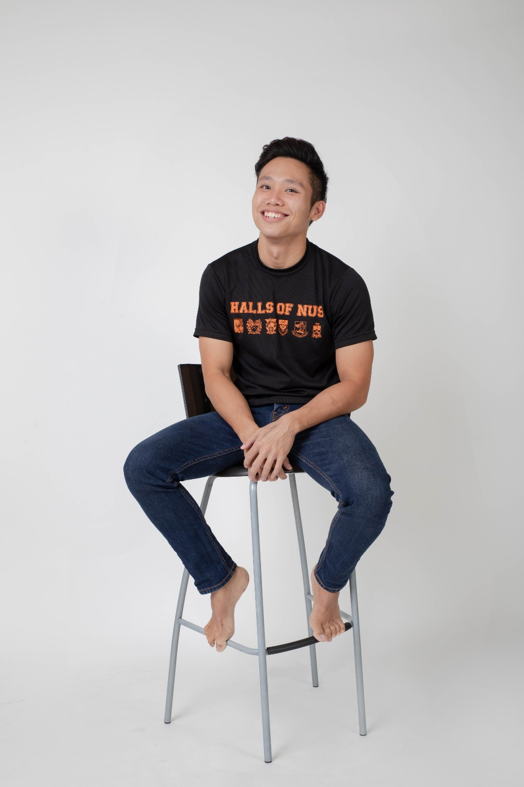

# The Start of my Journey
Despite pursuing a biomedical engineering degree, I discovered my love for programming and data science later on in my University journey. I started incorporating aspects of programming into my classes/modules, making the process exponentially more enjoyable and streamlined. From then on, I realise that Data Science was something I wanted to pursue.

# Building Towards Graduation
Determined to not be limited by my major, I took up statistical programming modules to gain more knowledge and experience, eventually getting a minor in statistics. 
I also took up multiple online courses such as the "Data Scientist with Python" track by DataCamp and "MITx Micromaster in Data Science and Statistics" by EDX to fully equip myself with the relevant skills. In addition, I pursued internships at Illumina and Hewlett-Packard (HP) doing Business Analytics and Data Science. These internships taught me that data science extended far beyond building ML models -- comprising of other aspects such as providing meaningful actionable insights to shareholders and the understanding and rectification of current models to tackle data/concept drift. 

As I embark on my personal projects and future job opportunities, I am excited to provide value and support to my team and the people I work with.

# Hobbies
Apart from spending copious amounts of time on techies shows on Youtube like LinusTechTips, I also enjoy playing Overwatch and watching Netflix.
 I also love sports, playing for a Touch Rugby club every week and gymming.

